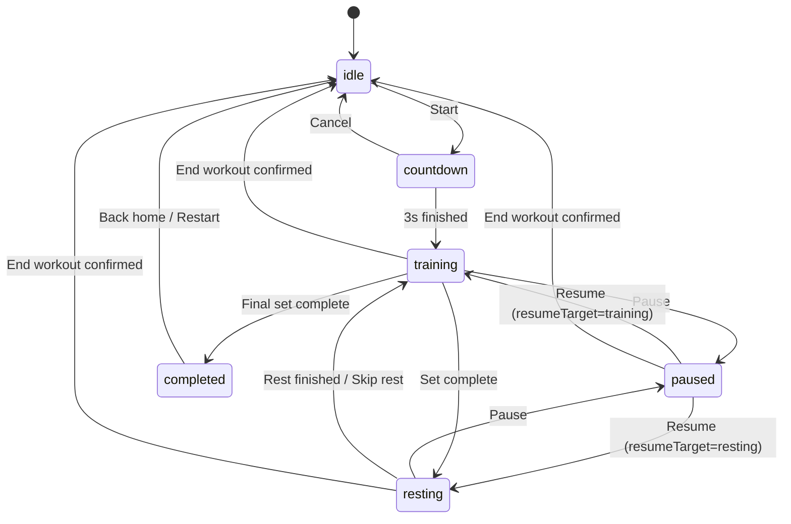

# Apple Watch 深蹲计数器 MVP 需求文档（V1）

## 一、项目概述

### 1.1 项目名称

深蹲计数器 / Squat Counter

### 1.2 产品定位

一款运行在 Apple Watch 上的独立训练 App，帮助用户在做深蹲训练时自动完成计数、固定节奏辅助和组间休息提醒，让用户专注动作本身，而不是分心记数。

### 1.3 项目阶段

MVP（最小可行版本）

### 1.4 文档用途

本需求文档主要用于：

- 面向 watchOS 产品与工程实现
- 面向 AI 编码工具生成原型或代码
- 面向后续版本迭代时的范围边界与验收对齐

---

## 二、目标用户与核心价值

### 2.1 目标用户

核心用户为以下人群：

- 居家健身用户
- 力量训练初中级用户
- 自重训练用户
- 希望通过 Apple Watch 获得训练辅助的用户

### 2.2 用户痛点

用户在做深蹲时，常见问题包括：

- 做到后面记不清次数
- 一边做动作一边数数，容易分心
- 节奏不稳定，训练体验不连贯
- 组间休息依赖自己计时，打断训练状态

### 2.3 核心价值

本产品的核心价值是：

- 自动计数，减少认知负担
- 固定节奏辅助，让训练更稳定
- 自动休息提醒，优化训练流畅度
- 通过震动反馈提供轻量、即时、低打扰的训练陪伴

---

## 三、MVP 目标与范围边界

### 3.1 MVP 目标

MVP 阶段的目标是完成一个最小训练闭环，让用户可以在 Apple Watch 上完成一次完整的深蹲训练流程：

打开应用 -> 设置参数 -> 开始倒计时 -> 自动计数训练 -> 单组完成后自动休息 -> 下一组开始 -> 全部完成

### 3.2 MVP 重点要解决的问题

1. 用户可以快速开始一组深蹲训练
2. 手表可以自动记录每次完整深蹲
3. 训练开始前有固定准备倒计时
4. 训练中有固定节奏提示辅助
5. 每组完成后可以自动休息和提醒
6. 用户全程基本不需要频繁操作屏幕

### 3.3 MVP 明确包含范围

- Apple Watch 独立训练 App
- 参数配置：每组次数、总组数、休息时间
- 固定 3 秒开始倒计时
- 训练中自动计数
- 固定节奏震动提示
- 单次计数、组完成、休息结束、训练完成的震动反馈
- 组间休息倒计时与跳过休息
- 训练中手动 `+1 / -1` 修正
- 训练中与休息中的暂停 / 恢复
- 中途结束训练并丢弃当前进度

### 3.4 MVP 暂不覆盖范围

本版本不纳入以下内容：

- Widget、Complication、Smart Stack 卡片
- 多动作识别（如俯卧撑、弓步、波比跳等）
- 动作质量分析
- AI 动作纠错
- 训练历史记录
- 成就体系
- 云同步
- iPhone 复杂联动
- 社交分享
- 个性化训练计划
- 卡路里估算
- 语音播报
- 用户自定义节奏频率

---

## 四、核心功能定义

### 4.1 深蹲自动计数

#### 功能目标

识别用户完成的完整深蹲动作，并自动累计次数。

#### 功能说明

系统基于 Apple Watch 的运动传感器，对用户深蹲动作进行简化识别。一次完整深蹲计数需要满足：

1. 从稳定站立状态开始
2. 出现明显下蹲趋势
3. 到达动作低点
4. 再回到接近站立状态
5. 整个动作形成完整闭环后，计为 1 次

#### 产品要求

- 仅统计完整动作
- 尽量避免半蹲、晃动、误抬手等误识别
- 每识别成功一次，页面实时更新
- 单次计数成功后给予轻微震动反馈
- 当前次数达到目标次数后，立即停止本组计数并进入组间休息

#### MVP 实现原则

- 正常深蹲节奏下识别可用
- 状态切换正确
- 误识别率可接受
- 保留后续替换真实识别算法的能力
- 识别管理模块只输出事件，不直接操作页面状态

### 4.2 开始前倒计时

#### 功能目标

在用户点击开始训练后，提供简短准备时间，避免用户刚点击开始就错过第一下动作。

#### 功能说明

- 用户点击 `Start` 后先进入固定 3 秒倒计时
- 倒计时结束后自动进入训练态
- 倒计时期间不开放计数
- 倒计时期间允许用户取消并返回首页

#### MVP 默认规则

- `countdownSeconds = 3`
- MVP 不提供用户自定义倒计时时长

### 4.3 固定节奏提示

#### 功能目标

通过简单固定节奏提示，帮助用户保持相对稳定的训练节奏。

#### 功能说明

- 用户进入训练状态后，系统提供固定频率节奏辅助
- 提示形式以震动为主
- 节奏提示仅作为辅助，不参与计数判定
- 识别成功仍以动作闭环为准，而不是以节奏触发为准

#### MVP 默认规则

- 默认开启节奏提示
- MVP 不支持用户自定义频率
- 暂停时停止节奏提示，恢复时继续

### 4.4 组间休息

#### 功能目标

每组训练完成后，自动进入休息阶段，帮助用户形成完整训练节奏。

#### 功能说明

当当前组达到目标次数后：

- 自动停止本组计数
- 自动进入休息倒计时页面
- 倒计时结束后提醒进入下一组
- 用户可选择提前开始下一组

#### MVP 默认值

- 默认休息时间：30 秒

#### 支持设置范围

- 15 秒到 120 秒
- 通过统一 stepper 设置

#### 边界规则

- 进入休息后，不再允许对上一组进行 `+1 / -1` 修正
- 最后一组完成后不进入休息页，直接进入完成页

### 4.5 震动反馈

#### 功能目标

通过 Apple Watch 震动，在关键节点给用户明确、低打扰反馈。

#### 震动场景定义

1. 开始倒计时：每秒一次轻提示
2. 单次深蹲识别成功：轻震
3. 单组完成：中等震动
4. 休息结束：中等震动
5. 全部训练完成：强震动
6. 固定节奏提示：规律轻提示

#### 产品要求

- 震动反馈应与当前状态一致
- 不应出现重复或过于频繁的震动打扰
- 反馈要让用户不看屏幕也能感知关键进度
- 节奏震动与单次计数震动冲突时，优先保留计数震动

### 4.6 手动修正计数

#### 功能目标

在自动计数出现偶发误差时，让用户可以快速修正当前次数。

#### 功能说明

训练中支持：

- `+1`
- `-1`

#### 设计原因

自动识别在 MVP 阶段很可能存在边界误差，如果完全没有修正手段，会严重影响用户信任。手动修正是重要的兜底能力。

#### 使用原则

- 修正入口要简洁
- 不影响主流程
- 优先服务于偶发纠错，而不是替代自动识别

#### 边界规则

- `+1 / -1` 仅在 `training` 状态可用
- `currentRep` 最小值为 `0`
- `currentRep` 最大值为 `repsPerSet`
- 用户通过 `+1` 达到目标次数时，应触发与自动计数一致的组完成逻辑

### 4.7 暂停 / 继续

#### 功能目标

允许用户在训练中或休息中临时暂停并恢复。

#### 功能说明

- 训练中暂停后：停止动作识别、停止节奏提示、停止界面自动变化
- 休息中暂停后：冻结休息倒计时
- 恢复后回到原先的子状态继续执行

#### 设计原则

- 暂停是覆盖态，不单独新增页面
- 系统必须记住暂停前是在训练中还是休息中

### 4.8 结束训练

#### 功能目标

允许用户主动中止本次训练并返回首页。

#### 功能说明

- 训练中和休息中都支持结束训练
- 点击结束训练后弹出确认
- 确认后丢弃当前会话进度并返回首页
- MVP 不保留中断进度，不支持稍后恢复

---

## 五、最小交互流程

### 5.1 用户主流程

1. 用户打开 App
2. 设置每组次数、组数、休息时间
3. 点击开始训练
4. 进入 3 秒准备倒计时
5. 倒计时结束后开始做深蹲
6. 每完成一次深蹲，系统自动加一
7. 当前组达到目标次数后，自动进入组间休息
8. 休息结束后进入下一组
9. 最后一组完成后，进入训练完成页

### 5.2 关键异常流程

- 倒计时期间取消：返回首页，不进入训练态
- 自动计数漏记：用户手动 `+1`
- 自动计数误记：用户手动 `-1`
- 训练中暂停：恢复后回到训练态
- 休息中暂停：恢复后回到休息态
- 训练中或休息中结束训练：确认后回首页
- 休息中提前开始：直接进入下一组训练

### 5.3 设计原则

- 操作步骤尽量少
- 屏幕信息尽量清晰
- 训练中尽量减少点击
- 用户主要依赖自动计数和震动反馈完成训练

---

## 六、页面结构设计

MVP 控制在 4 个核心页面 / 状态界面，暂停作为页面覆盖态处理。

### 6.1 设置页（首页）

#### 页面目标

让用户快速完成训练参数设置并进入训练。

#### 展示字段

- 每组次数 reps
- 总组数 sets
- 休息时间 rest
- 开始按钮 `Start`

#### 默认值

- 每组次数：15
- 总组数：3
- 休息时间：30 秒

#### 参数范围建议

- 每组次数：5 到 50
- 组数：1 到 10
- 休息时间：15 到 120 秒

#### 交互要求

- 采用适合 Apple Watch 的简洁交互方式
- 推荐使用 stepper 或上下调整控件
- 按钮与数字区分明显
- 确保用户可在 10 秒内完成设置并开始训练

### 6.2 训练页

#### 页面目标

展示当前训练进度，并承载自动计数与训练控制功能。

#### 展示内容

- 当前组数：例如“第 1 / 3 组”
- 当前次数：例如“8 / 15”
- 当前状态：倒计时中 / 训练中 / 暂停中
- 暂停按钮
- 结束按钮
- 手动 `+1`
- 手动 `-1`

#### 视觉优先级

1. 当前次数最大最醒目
2. 当前组数次级展示
3. 状态信息简洁显示
4. 操作按钮不宜过多占用空间

#### 交互要求

- 训练页信息必须一眼可读
- 适配 Apple Watch 小屏
- 不堆叠无关信息
- 训练中优先自动流程，按钮为辅助能力
- 倒计时中不显示 `+1 / -1`

### 6.3 休息页

#### 页面目标

在组间为用户提供短暂停顿与下一组准备。

#### 展示内容

- “本组完成”
- 当前休息倒计时：例如“29s”
- 下一组提示：例如“即将开始第 2 组”
- 提前开始按钮
- 暂停 / 继续按钮
- 结束训练按钮

#### 交互要求

- 倒计时必须醒目
- 结束后自动进入下一组
- 用户可主动跳过剩余休息时间
- 休息页不显示 `+1 / -1`

### 6.4 完成页

#### 页面目标

在全部训练完成后，明确给用户完成反馈。

#### 展示内容

- “训练完成”
- 完成组数
- 总完成次数
- 总训练时长（可选）
- 再来一次
- 返回首页

#### 交互要求

- 强调完成感
- 页面简洁
- 支持快速开始下一轮训练

---

## 七、状态机设计

为了便于 watchOS 工程实现，需要明确主状态、暂停恢复规则和动作识别子状态。

### 7.1 主状态定义

- `idle`：未开始
- `countdown`：训练开始前准备倒计时
- `training`：训练中
- `resting`：组间休息中
- `paused`：暂停中
- `completed`：全部训练完成

### 7.2 暂停恢复规则

- 当状态为 `paused` 时，必须额外记录 `resumeTarget`
- `resumeTarget = training` 表示从训练中暂停
- `resumeTarget = resting` 表示从休息中暂停
- 恢复时根据 `resumeTarget` 返回原状态

### 7.3 动作识别子状态

用于动作识别逻辑内部判断：

- `standing`：站立准备
- `descending`：下蹲中
- `bottom`：达到低点
- `ascending`：起身中
- `repCompleted`：完成一次动作

### 7.4 状态流转规则



---

## 八、计数逻辑建议

### 8.1 一次有效深蹲的定义

一次有效深蹲需要满足以下闭环：

1. 稳定站立
2. 明显向下运动
3. 到达动作底部
4. 向上回正
5. 回到接近起始站立位置

只有完成闭环，才记为 1 次。

### 8.2 防误触原则

以下行为原则上不应计数：

- 原地轻微晃动
- 抬腕查看屏幕
- 小幅下沉又回正
- 半蹲动作
- 非深蹲动作带来的传感器波动

### 8.3 去重机制

为避免一次动作被连续识别多次，建议增加冷却时间：

- 每次计数成功后，增加 600 到 1000ms cooldown
- 冷却期间不允许再次计数

### 8.4 识别策略建议

MVP 阶段先采用“简化动作识别 + 可调阈值”方案实现，不需要一开始就追求复杂算法，但需要预留识别管理模块，方便后续替换真实实现。

### 8.5 事件接口约束

- 识别模块输出 `repDetected` 事件
- 可选输出 `motionStateChanged` 事件供调试或界面提示使用
- 训练页计数、组完成、状态切换都由统一 ViewModel 消费事件后处理

---

## 九、参数建议

### 9.1 默认参数

- `repsPerSet = 15`
- `totalSets = 3`
- `restSeconds = 30`
- `countdownSeconds = 3`
- `tempoCueEnabled = true`

### 9.2 内部可调识别参数

以下参数可先在代码中写死，不暴露给用户：

- 最小动作幅度阈值
- 起始站立稳定判定时长
- 下蹲低点阈值
- 回正阈值
- 计数冷却时间
- 节奏提示固定频率

---

## 十、异常与边界场景

### 10.1 识别失败

#### 场景

系统未识别到某次真实深蹲。

#### 处理方案

- 不中断训练流程
- 用户可手动 `+1`

### 10.2 误计数

#### 场景

系统误把非完整动作识别为一次深蹲。

#### 处理方案

- 不弹复杂提示
- 用户可手动 `-1`
- 后续优化阈值逻辑

### 10.3 倒计时中取消

#### 场景

用户点击开始后又临时不想训练。

#### 处理方案

- 在 `countdown` 中允许取消
- 取消后返回 `idle`
- 不保留脏进度

### 10.4 用户中途暂停

#### 场景

用户需要临时中断训练或休息。

#### 处理方案

- 切换到 `paused`
- 记录 `resumeTarget`
- 来自 `training` 的暂停：停止识别与节奏提示
- 来自 `resting` 的暂停：冻结倒计时
- 恢复后回到 `resumeTarget`

### 10.5 用户中途结束训练

#### 场景

用户不想继续当前训练。

#### 处理方案

- 训练中、休息中、暂停中均可结束训练
- 弹出确认或二次确认逻辑
- 确认后退出当前训练，回到首页
- MVP 阶段不保留中断进度

### 10.6 休息中提前开始

#### 场景

用户不想等完整倒计时。

#### 处理方案

- 提供“提前开始下一组”
- 点击后直接进入下一组训练

### 10.7 最后一组完成

#### 场景

最后一组训练完成。

#### 处理方案

- 不进入休息页
- 直接跳转到完成页

### 10.8 小屏与训练状态冲突

#### 场景

Apple Watch 屏幕小，用户训练中不方便频繁查看。

#### 处理方案

- 训练页大字显示当前次数
- 减少复杂文字
- 关键节点依赖震动反馈

### 10.9 手动修正边界

#### 场景

用户连续点击修正按钮导致计数越界。

#### 处理方案

- `-1` 不允许小于 0
- `+1` 不允许超过当前组目标次数
- 达到目标次数后立即切换组完成逻辑，关闭修正入口

---

## 十一、数据结构建议

以下为 MVP 阶段建议的数据模型。

### 11.1 训练配置

```swift
struct WorkoutConfig {
    var repsPerSet: Int
    var totalSets: Int
    var restSeconds: Int
    var countdownSeconds: Int = 3
    var tempoCueEnabled: Bool = true
}
```

### 11.2 训练会话状态

```swift
enum WorkoutState {
    case idle
    case countdown
    case training
    case resting
    case paused
    case completed
}
```

### 11.3 动作识别状态

```swift
enum SquatMotionState {
    case standing
    case descending
    case bottom
    case ascending
    case repCompleted
}
```

### 11.4 识别事件

```swift
enum SquatDetectionEvent {
    case repDetected
    case motionStateChanged(SquatMotionState)
}
```

### 11.5 当前训练进度

```swift
struct WorkoutProgress {
    var currentSet: Int
    var currentRep: Int
    var totalCompletedReps: Int
    var remainingRestSeconds: Int
}
```

### 11.6 暂停恢复信息

```swift
struct PauseContext {
    var resumeTarget: WorkoutState
}
```

---

## 十二、模块拆分建议

### 12.1 Views

- `WorkoutConfigView`
- `WorkoutSessionView`
- `RestView`
- `WorkoutCompleteView`

### 12.2 ViewModels

- `WorkoutSessionViewModel`

### 12.3 Managers

- `SquatDetectionManager`
- `HapticManager`
- `TimerManager`

### 12.4 Models

- `WorkoutConfig`
- `WorkoutProgress`
- `WorkoutState`
- `PauseContext`
- `SquatMotionState`
- `SquatDetectionEvent`

### 12.5 责任边界

- `SquatDetectionManager`：采集传感器并输出识别事件
- `HapticManager`：统一封装不同场景的震动反馈
- `TimerManager`：驱动开始倒计时、组间休息、固定节奏提示
- `WorkoutSessionViewModel`：统一管理训练会话、计数、组数、暂停恢复、完成判定

---

## 十三、实现建议（面向 watchOS）

### 13.1 技术方向

- 平台：watchOS
- UI：SwiftUI
- 架构建议：MVVM

### 13.2 实现原则

- 优先完成“能跑通的完整训练流程”
- 优先保证状态流转正确
- 优先保证 Apple Watch 小屏交互清晰
- 动作识别模块先抽象，再逐步增强精度

### 13.3 关键实现思路

- 将深蹲识别封装为独立管理器
- 将震动反馈封装为独立管理器
- 将倒计时、休息计时、固定节奏提示统一交给计时管理器
- 由统一 ViewModel 管理训练会话、计数、组数、休息状态、暂停恢复
- 页面层只负责展示和触发交互

### 13.4 推荐实现顺序

1. 先搭建 `WorkoutConfig -> countdown -> training -> resting -> completed` 主状态流
2. 再补暂停 / 恢复与结束训练确认逻辑
3. 再接入 `SquatDetectionManager` 的事件流
4. 最后补齐固定节奏提示与各类震动策略

---

## 十四、MVP 验收标准

满足以下条件即可视为 MVP 基本成立：

- 可以设置每组次数、总组数、休息时间
- 可以从首页顺利开始训练
- 点击开始后进入固定 3 秒倒计时
- 倒计时结束后自动进入训练
- 训练中可自动计数
- 单次计数成功后有反馈
- 训练中存在固定节奏提示
- 单组完成后自动进入休息
- 休息结束后自动进入下一组
- 所有组完成后进入完成页
- 支持训练中暂停 / 继续
- 支持休息中暂停 / 继续
- 支持手动 `+1 / -1` 修正
- 训练中与休息中都支持结束训练并返回首页
- 关键状态流转无明显错误

---

## 十五、测试场景清单

- 用户从首页使用默认参数，在 10 秒内开始训练并完成整套流程
- 开始倒计时 3 秒后自动进入训练；倒计时中取消可回首页且不留脏状态
- 正常深蹲闭环被计为 1 次，页面数字实时更新，并触发轻震
- 半蹲、抬腕、轻微晃动不会被计数
- 单次计数后的 cooldown 生效，不会被一组连续动作重复计数
- 当前组达到目标 reps 后立即进入休息，且休息页倒计时正确递减
- 休息结束自动进入下一组；最后一组完成直接进入完成页
- 训练中 `+1 / -1` 可正常修正，且不会出现负数或超过目标后继续累加
- 训练中暂停后，识别与节奏提示停止；恢复后继续当前组当前次数
- 休息中暂停后，倒计时冻结；恢复后继续剩余休息时间
- 训练中或休息中结束训练，确认后回首页且不保留中断进度
