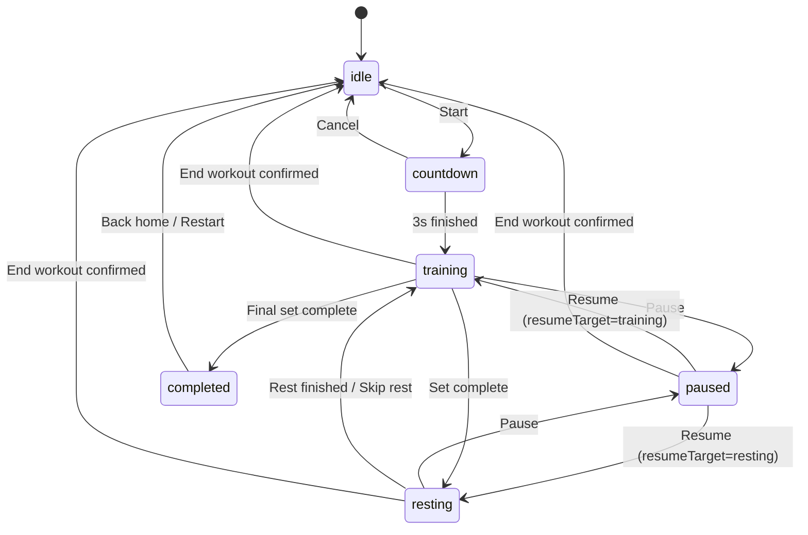

# Squat Counter（Apple Watch 深蹲计数器）

一款运行在 Apple Watch 上的独立训练 App，帮助用户在做深蹲时实现自动计数、节奏辅助和组间休息提醒，让用户专注动作本身而不是手动记数。

> 当前仓库处于 **工程骨架完成，进入核心实现期**，核心需求见 [PRD/PRD_V1.md](PRD/PRD_V1.md)。

## 项目目标（MVP）

在 watchOS 上跑通最小训练闭环：

`打开应用 -> 参数设置 -> 3 秒倒计时 -> 自动计数训练 -> 组间休息 -> 下一组 -> 完成训练`

## 目标用户

- 居家健身用户
- 力量训练初中级用户
- 自重训练用户
- 希望通过 Apple Watch 获得训练辅助的用户

## 核心价值

- 自动计数，降低认知负担
- 固定节奏辅助，提升训练稳定性
- 组间自动休息提醒，减少流程中断
- 关键节点震动反馈，低打扰完成训练

## MVP 范围

### 包含

- Apple Watch 独立训练流程
- 参数配置：每组次数、总组数、休息时间
- 固定 3 秒开始倒计时
- 深蹲自动计数（支持后续算法替换）
- 固定节奏震动提示
- 训练与休息阶段的暂停/恢复
- 训练中手动 `+1 / -1` 修正
- 组间休息倒计时与“提前开始下一组”
- 中途结束训练并丢弃当前进度

### 暂不包含

- Widget / Complication / Smart Stack
- 多动作识别与动作质量分析
- AI 动作纠错
- 历史记录、成就体系、云同步
- 社交分享、个性化训练计划
- 语音播报、卡路里估算
- 用户自定义节奏频率

## 用户主流程

1. 进入设置页，设置 reps / sets / rest。
2. 点击 `Start`，进入 3 秒倒计时。
3. 进入训练态，自动识别完整深蹲并累计次数。
4. 达到单组目标后自动进入休息态。
5. 休息结束进入下一组（可手动跳过休息）。
6. 最后一组完成后进入完成页。

## 状态机

## 默认参数与约束

| 参数 | 默认值 | 可配置范围 |
| --- | --- | --- |
| `repsPerSet` | 15 | 5 ~ 50 |
| `totalSets` | 3 | 1 ~ 10 |
| `restSeconds` | 30 | 15 ~ 120 |
| `countdownSeconds` | 3 | MVP 固定 |
| `tempoCueEnabled` | true | MVP 固定开启 |

## 技术方案（建议）

- 平台：watchOS
- UI：SwiftUI
- 架构：MVVM
- 关键模块：
  - `WorkoutSessionViewModel`：统一管理状态流转、计数、组数、暂停恢复
  - `SquatDetectionManager`：动作识别并输出事件
  - `TimerManager`：倒计时、休息计时、固定节奏提示
  - `HapticManager`：统一管理震动反馈

## MVP 验收清单

- [ ] 可设置每组次数、总组数、休息时间
- [ ] 可从首页开始训练并进入 3 秒倒计时
- [ ] 倒计时结束后自动进入训练态
- [ ] 训练中可自动计数并有单次反馈
- [ ] 训练中存在固定节奏提示
- [ ] 达到单组目标后自动进入休息态
- [ ] 休息结束自动进入下一组
- [ ] 最后一组完成后进入完成页
- [ ] 支持训练/休息阶段暂停与恢复
- [ ] 支持训练中 `+1 / -1` 修正且不越界
- [ ] 支持中途结束训练并返回首页
- [ ] 关键状态流转稳定，无明显错误

## 仓库说明

当前仓库已同时承载三类内容：

- 工程代码：`SquatCounteriOS`、`SquatCounterWatchExtension`、`Shared`
- 项目基线：`PRD/`、`docs/architecture/`、`docs/planning/`
- 协作规则：`AGENTS.md`、`docs/agents/`、`docs/release/`
- 经验沉淀：`docs/knowledge/`

## 项目协作结构

- `docs/agents/`：角色定义、任务模板、拆分规则
- `docs/planning/`：阶段、风险、决策、任务状态
- `docs/release/`：发布、部署、回滚、测试门禁
- `docs/knowledge/`：可复用的方法论经验沉淀

## 参考文档

- 需求文档（V1）：[PRD/PRD_V1.md](PRD/PRD_V1.md)
- 架构说明：[docs/architecture/ARCHITECTURE.md](docs/architecture/ARCHITECTURE.md)
- 项目执行基线：[docs/planning/PROJECT_WBS.md](docs/planning/PROJECT_WBS.md)
- 当前阶段：[docs/planning/CURRENT_SPRINT.md](docs/planning/CURRENT_SPRINT.md)
- Agent 体系：[docs/agents/AGENT_SYSTEM.md](docs/agents/AGENT_SYSTEM.md)
